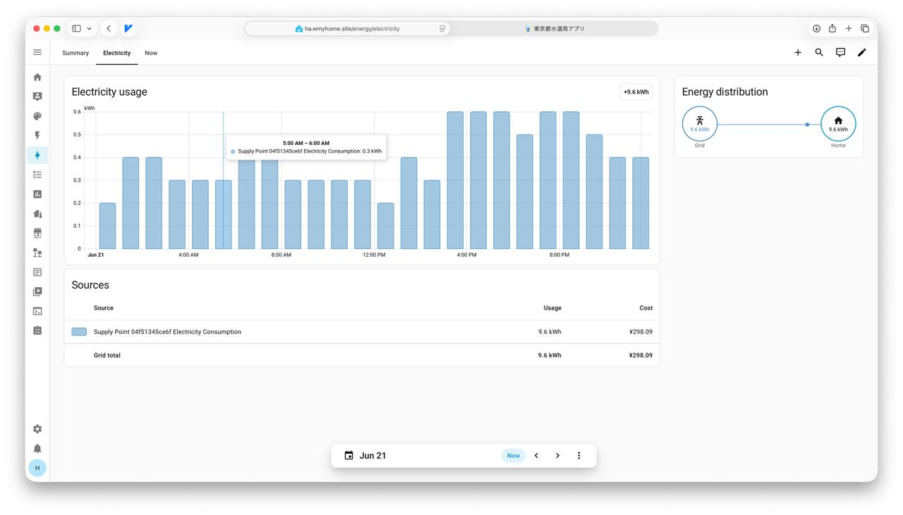
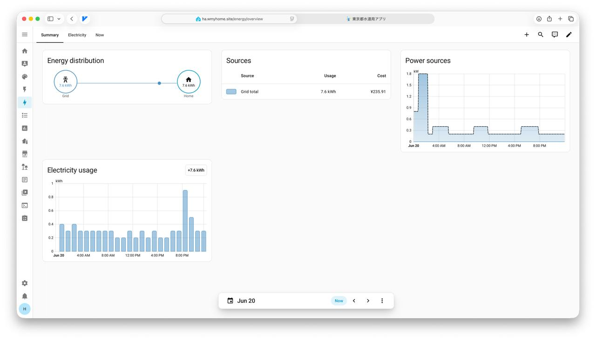

# Octopus Energy OEJP — Home Assistant Custom Integration

[](https://github.com/hacs/integration)
[](https://github.com/strongbugman/ha-octopusenergy-oejp-demo/actions/workflows/hacs-validation.yml)
[](https://github.com/strongbugman/ha-octopusenergy-oejp-demo/actions/workflows/test-and-release.yml)
[](LICENSE)

A fully featured Home Assistant custom integration for the **Octopus Energy Japan (OEJP)** and region-aligned Kraken API platforms.

By authenticating via the secure GraphQL `obtainKrakenToken` mutation, this integration continuously synchronizes account balances, active contracts, bills, transactions, and half-hourly interval readings natively into Home Assistant. It fully supports the **Home Assistant Energy Dashboard** with automatically updated external statistics for aggregate consumption (kWh) and cost (JPY).

---

## Example Lovelace Showcase




---

## Features

- ⚡ **Asynchronous & Efficient:** Built entirely using async `httpx` to execute optimized GraphQL queries. It implements connection reuse via a single persistent client, ensuring minimal load on your Home Assistant runner.
- 📊 **Energy Dashboard Native:** Provides cumulative consumption (kWh) and cumulative cost (JPY) tracking that seamlessly links with HA's built-in Energy dashboard statistics.
- 🕒 **JST Timezone Aggregation:** Aggregates half-hourly readings based on Japanese Standard Time (JST) boundaries to present precise, real-time metrics for:
  - **Today** (JST calendar day)
  - **This Week** (Monday-start JST week)
  - **This Month** (Current JST calendar month)
- 🔒 **Privacy-First Design:** Sensitive raw identifiers like Account Numbers and SPINs (Supply Point Identification Numbers) are **never** stored in plaintext or sent to the Home Assistant state engine. The integration automatically generates unique IDs and entity names using a short, saltless SHA-256 fingerprint.
- 📉 **Derived Metrics:** Exposes calculated fields such as `Latest Half-Hour Average Power (W)` and `Latest Half-Hour Average Cost Rate (JPY/kWh)` to help you understand your live consumption trends even without a hardware smart meter.

---

## Installation

### Method 1: HACS Custom Repository (Highly Recommended)

You can easily install this integration via the Home Assistant Community Store (HACS) as a Custom Repository:

1. Open **HACS** in your Home Assistant instance.
2. Click the three dots in the top-right corner and select **Custom repositories**.
3. Add the following repository URL:
   ```text
   https://github.com/strongbugman/ha-octopusenergy-oejp
   ```
4. Choose **Integration** as the Category and click **Add**.
5. Once added, you can find and download **Octopus Energy OEJP** from your HACS integrations page.
6. **Restart Home Assistant** to load the integration.

### Method 2: Manual Installation via ZIP (Recommended for Local Deployments)

1. Build or download the release ZIP.
2. Extract the archive into your Home Assistant `/config/` directory so that the files are placed at:
   ```text
   /config/custom_components/octopusenergy_oejp/
   ```
3. To build a ZIP locally from a git checkout, run:
   ```bash
   .venv/bin/python scripts/package_integration.py
   ```
   This will package the integration into `dist/octopusenergy_oejp-<version>.zip`, automatically excluding local test files, environment variables, credentials, caches, and developer notes.
4. **Restart Home Assistant.**
5. Navigate to **Settings → Devices & Services → Add Integration** and search for **Octopus Energy OEJP**.

### Method 3: Manual Installation via Copy

Copy the `custom_components/octopusenergy_oejp/` directory directly into your Home Assistant `/config/custom_components/` path. Restart Home Assistant, and then proceed with configuration via the UI.

---

## Configuration

| Form Field | Required | Default | Description |
| :--- | :---: | :--- | :--- |
| **Email** | Yes | | Your registered Octopus Energy account email. |
| **Password** | Yes | | Your registered Octopus Energy account password. |
| **API Base URL** | No | `https://api.oejp-kraken.energy` | Custom GraphQL endpoint (overridable for testing or alternative regional Kraken endpoints). |

*Note: The integration automatically appends `/v1/graphql/` to the provided API Base URL.*

---

## Exposed Sensors

### 1. Summary Sensors (Always Created)

| Sensor | State/Type | Description |
| :--- | :--- | :--- |
| **Account Count** | Numeric | Total number of accounts tied to your login. |
| **Property Count** | Numeric | Total number of registered properties. |
| **Electricity Supply Points** | Numeric | Total number of active electrical connections. |
| **Bills Total** | Numeric | Total number of historical invoices generated. |
| **Transactions Total** | Numeric | Total number of financial ledger entries. |
| **Active Agreements** | Numeric | Number of currently active pricing contracts. |

### 2. Per-Account Sensors

Each account creates a unique group of sensors identified by a short fingerprint prefix (e.g. `Account {fingerprint} Balance`):

| Sensor | State/Type | Unit | Description |
| :--- | :--- | :---: | :--- |
| **Account Balance** | Numeric | JPY | Outstanding or credited account balance. |
| **Account Status** | String | | The contract state (e.g., `ACTIVE`). |
| **Account Bills Total** | Numeric | | Total invoice count for this specific account. |
| **Account Transactions Total** | Numeric | | Total transaction ledger count for this account. |

### 3. Per-Electricity Supply Point Sensors

Each supply point creates a dedicated set of sensors (using a short fingerprint to redact the physical SPIN):

| Sensor | Unit | State Class | Device Class | Description |
| :--- | :---: | :---: | :---: | :--- |
| **Supply Point Status** | | | | e.g. `ON_SUPPLY`, `ACTIVE`. |
| **Next Reading Date** | | | | Next scheduled meter-reading cycle. |
| **Today Consumption** | `kWh` | `total` | `energy` | Total consumption since JST midnight. |
| **Today Cost** | `JPY` | `total` | `monetary` | Total cost estimate since JST midnight. |
| **This Week Consumption** | `kWh` | `total` | `energy` | Total consumption since Monday 00:00 JST. |
| **This Week Cost** | `JPY` | `total` | `monetary` | Total cost estimate since Monday 00:00 JST. |
| **This Month Consumption** | `kWh` | `total` | `energy` | Total consumption since 1st of the month JST. |
| **This Month Cost** | `JPY` | `total` | `monetary` | Total cost estimate since 1st of the month JST. |
| **Latest Interval Reading Value** | `kWh` | `measurement` | `energy` | Latest monthly/interval physical reading value. |
| **Latest Half-Hour Reading Value** | `kWh` | `measurement` | `energy` | Most recent individual half-hourly consumption. |
| **Latest Half-Hour Average Power** | `W` | `measurement` | `power` | Derived power (W) based on the latest half-hour kWh average. |
| **Latest Half-Hour Average Cost Rate** | `JPY/kWh` | `measurement` | | Effective rate (JPY per kWh) calculated for the latest period. |
| **Cumulative Consumption** | `kWh` | `total_increasing` | `energy` | Continuous monotonic running total for Energy Dashboard. |
| **Cumulative Cost** | `JPY` | `total_increasing` | `monetary` | Continuous monotonic running cost for Energy Dashboard. |

---

## Data Update & Architecture

- **Polling Frequency:** The data coordinator queries the GraphQL endpoints once every **15 minutes**.
- **Fetch Window:** Half-hourly consumption records are fetched starting from the earlier of the current JST calendar week start and current month start up to the present instant. This ensures today/week/month period aggregates are always perfectly accurate and self-healing.
- **Access States:** Detailed diagnostic sensors like `Interval Readings Access` and `Half-Hour Readings Access` will report `authorized`, `unauthorized`, `disabled`, or `error` depending on your account permissions, allowing for quick troubleshooting if consumption charts are empty.

---

## Local Development & Testing

Setting up a complete virtual development environment is simple:

```bash
# 1. Create and activate venv
python -m venv .venv
source .venv/bin/activate

# 2. Install package in editable mode with development/test dependencies
pip install -e ".[test]"

# 3. Setup local environment configurations (optional)
cp .env.example .env   # Populate with OCTOPUS_EMAIL and OCTOPUS_PASSWORD
```

### Running the Test Suite

Our codebase includes a comprehensive, mocked test suite that runs 100% locally with zero external network dependencies:

```bash
# Run all unit and integration tests
.venv/bin/python -m pytest

# Execute compilation checks
.venv/bin/python -m compileall -q custom_components tests
```

### Real Account Inspection Tools

You can generate a completely redacted and privacy-safe diagnostic report of your real Octopus account. This helps verify query shapes and field mappings against live API payloads without exposing any secrets:

```bash
# Generate a detailed redacted audit report at reports/real_account_data_report.md
.venv/bin/python scripts/fetch_sensors.py --format table
```

Check the `reports/` folder to view pre-existing performance audits, asynchronous migration benchmarks, and publish-readiness verification reports.

---

## License

This integration is licensed under the **MIT License**. See [LICENSE](LICENSE) for details.
